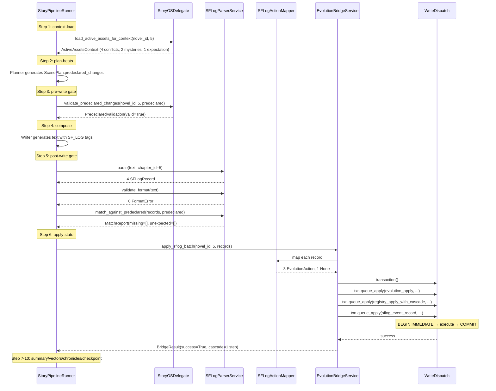

# StoryForge2 tier_0 机制集成 PlotPilot 设计 spec

> **Phase 1 of 2**: 引入 StoryForge2 的 tier_0 SF_LOG 机制（SF_LOG 标签解析 + 8 个叙事资产注册表 + 级联事务管理器）。
> **Phase 2**（不在本文档范围）：CreativeOS 创意发散引擎（Mutation / WhatIf / Contradiction / GenreFusion / NoveltyEvaluator）。

- **日期**：2026-07-02
- **作者**：Claude（协作设计）
- **状态**：Draft → 待用户 review
- **目标版本**：PlotPilot v1.2

---

## 0. 决策记录（Decisions）

9 项 Q&A 决策 + 3 项 review 修订：

| # | 议题 | 决策 | 影响 |
|---|---|---|---|
| Q1 | 交付节奏 | 分两阶段（Phase 1 = tier_0，Phase 2 = CreativeOS） | 本文仅覆盖 Phase 1 |
| Q2 | SF_LOG 与 Evolution 关系 | **互补**：SF_LOG 作源头（LLM 自证清白），Evolution 作门控（合法性校验） | 两者通过 `EvolutionBridgeService` 协同 |
| Q3 | Registry 持久化 | SQLite + ORM Mapper | 跨表原子性走 SQL 事务 |
| Q4 | Pipeline 集成时机 | **三层**：预声明（Step 2）+ Writer 插入（Step 4）+ 解析（Step 5-6） | 与 StoryForge2 SceneSchema 对位 |
| Q5 | Registry 范围 | **全量 8 个**（含 Foreshadowing 迁移） | Foreshadowing 从 `domain/novel/` 剥离到 `domain/storyos/` |
| Q6 | 前端暴露 | 完整工作台面板（StoryOSHub + 6 子视图） | 新增 `/workbench/:novelId/storyos` 路由 |
| Q7 | LLM Provider 兼容性 | 统一 prompt + 自适应增强 | 通过合规率数据动态调整 directive |
| Q8 | 现有项目迁移 | **惰性初始化 + 旧伏笔自动转换**（单向迁移，旧表只读） | 一次性迁移脚本 + 旧表保留至 Phase 2 |
| Q9 | 架构整合方式 | **新 bounded context `storyos/`**，与 Evolution 平级 | 完整 DDD 四层 |
| R1 | Predeclared asset 形态 | `asset_id \| asset_pair` 二选一 + model_validator | 支持关系型 SF_LOG（如 `char_a/char_b`） |
| R2 | conflict_escalate 是否触发级联 | **是**：新增 `CONFLICT_ESCALATED` 触发器，关联 expectation `intensity += 30` | 与 StoryForge2 不同（更激进） |
| R3 | 失败 D 重试策略 | **两级**：predeclared 缺失→retry；额外 SF_LOG→warn（不 retry） | 复用 Fact Guard CircuitBreaker，扩展多 gate |

---

## 1. 背景与目标

### 1.1 背景

PlotPilot 当前 Evolution Engine 通过 LLM 抽取（`action_extractor.py`）从章节文本中识别状态变更，依赖 prompt 工程和正则兜底，长篇一致性靠 LLM 自觉。

StoryForge2 的 tier_0 设计用 **SF_LOG 注释标签 + 零 LLM 正则解析** 把状态变更从「LLM 推断」变为「LLM 显式声明」，配合 5 类级联规则与 RegistryTransactionManager，把 narrative arc 管理变成可观测、可回滚、可审计的工程系统。

### 1.2 目标

将 StoryForge2 的 tier_0 机制有机融入 PlotPilot 的 10 步 BaseStoryPipeline，**不破坏**现有 DDD 四层 + Evolution Engine，新增 `storyos/` bounded context 作为 narrative arc 状态管理的新基础设施。

### 1.3 非目标（Out of Scope）

- CreativeOS 创意发散引擎（Phase 2）
- 旧 `domain_novel.foreshadowings` 表的彻底清理（Phase 2）
- `CONFLICT_RESOLVED` 的复杂级联细化（Phase 2 可选）
- 跨项目资产共享（本 Phase 单项目隔离）

---

## 2. 架构总览

### 2.1 一句话定位

新 bounded context `storyos/`（与 `evolution/` 平级），承载 8 类叙事资产的注册、级联和 SF_LOG 解析；通过 `EvolutionBridgeService` 与 Evolution Engine 协同——SF_LOG 提取为 LogRecord 后，**单 SQL 事务**双写：LogRecord → RegistryUpdate + LogRecord → EvolutionAction（经 Evolution Gate）。

### 2.2 五子系统心智模型更新

| 子系统 | 现状 | 变化 |
|---|---|---|
| 1. Narrative State Machine | EvolutionState + Foreshadowing | + StoryOS（8 Registry）+ Bridge |
| 2. Vector Retrieval Layer | ChromaDB + Qdrant + 知识三元组 | 不变 |
| 3. Engine Runtime | EngineDaemon → StoryPipelineRunner | + `StoryOSDelegate` 在 Step 1/3/5/6 钩子 |
| 4. Prompt Strategy Layer | 20+ 注入点 YAML | + `sflog_directive` 注入点 |
| 5. Quality Monitor | 张力/漂移/俗套 | + SF_LOG 格式合规率等 6 项指标 |

### 2.3 Pipeline 级有机整合图（6/10 步强制集成）

```
Step 1  context-load      → StoryOS: load_active_assets_for_context
Step 2  plan-beats        → Planner output includes predeclared_changes
Step 3  pre-write gate    → StoryOS: validate_predeclared_changes
Step 4  compose           → Writer receives sflog_directive + active assets
Step 5  post-write gate   → parse → validate → match (两级决策)
Step 6  apply-state ◄──   → write_dispatch.transaction():
                              ├ evolution_apply_actions (Evolution)
                              ├ registry_apply_with_cascade (StoryOS)
                              └ sflog_event_record (审计)
                            COMMIT | ROLLBACK
Step 7-10 summary/vectors/chronicles/checkpoint → 现有逻辑 + StoryOS 扩展
```

### 2.4 架构边界

```
domain/storyos/                零外部依赖，纯类型
application/storyos/           用例编排，可依赖 domain/ + infrastructure/
infrastructure/persistence/    SQLAlchemy 实现 + WriteDispatch 扩展（transaction）
interfaces/api/v1/storyos/     REST 端点
engine/runtime/storyos_delegate.py  唯一引擎接入点
frontend/views/workbench/storyos/   StoryOSHub + 6 子视图
```

---

## 3. Components

### 3.1 完整文件清单

```
domain/storyos/
  contracts.py                          # AssetStatus 12 态 + SFLogType 11 类 + RegistryAsset
  value_objects/
    sf_log.py                           # SFLogRecord, SFLogParam
    cascade.py                          # CascadeTrigger (6) + CascadeStep + CascadeResult + CascadeRules
    predeclared.py                      # PredeclaredChange (asset_id|asset_pair) + PredeclaredChanges + MatchReport
    format_error.py                     # FormatError
  entities/
    conflict.py                         # Conflict + ConflictIntensity
    mystery.py                          # Mystery + Clue
    twist.py                            # Twist + TwistType
    promise.py                          # Promise
    reveal.py                           # Reveal
    expectation.py                      # Expectation
    goal.py                             # Goal + ProgressMarker
    foreshadowing.py                    # Foreshadowing (从 domain/novel/ 迁移)

application/storyos/
  parsers/
    sf_log_regex_parser.py              # 11 类 SF_LOG 提取（零 LLM）
    sf_log_format_validator.py          # 格式严格校验
    sf_log_action_mapper.py             # SFLogRecord → EvolutionAction（6 映射 + 5 跳过）
  services/
    registry_service.py                 # 8 Registry CRUD + 状态变更入口
    cascade_service.py                  # BFS 级联 + 校验 + 原子提交（含 MAX_CASCADE_DEPTH=3）
    sf_log_parser_service.py            # parse → validate → match
    evolution_bridge_service.py         # 单 SQL 事务双写
    foreshadowing_migration_service.py  # 单向迁移（planted→PLANTED, resolved→REVEALED, abandoned→DEAD）
    snapshot_projector.py               # Snapshot 投影
    circuit_breaker_integration.py      # SFLogComplianceGate

infrastructure/persistence/
  write_dispatch.py                     # ⚡ 新增 transaction() context manager + queue_apply()
  storyos/
    schemas/                            # SQLAlchemy ORM 共 11 张表：
      conflict_schema.py
      mystery_schema.py
      twist_schema.py
      promise_schema.py
      reveal_schema.py
      expectation_schema.py
      goal_schema.py
      foreshadowing_schema.py
      cascade_history_schema.py
      sflog_event_schema.py
      bridge_log_schema.py              # ⚡ NEW：桥接失败聚合
    mappers/                            # ORM ↔ Domain 双向映射
    repositories/                       # 走 Write Dispatch
    migrations/versions/0001_storyos_init.py

interfaces/api/v1/storyos/
  schemas/                              # Pydantic DTO
  routes/{8 registry, cascade, sflog, migration, health}_routes.py
  crud_factory.py                      # 8 registry 样板生成

engine/
  pipeline/beat_contracts.py            # ⚡ ScenePlan.predeclared_changes 字段
  runtime/storyos_delegate.py           # 3 方法合一：load_active_assets_for_context / validate_predeclared_changes / apply_post_write_results

frontend/src/views/workbench/storyos/
  StoryOSHub.vue, RegistryList.vue, RegistryDetailDrawer.vue,
  CascadeGraph.vue, SFLogInspector.vue, PredeclaredDiff.vue
frontend/src/components/workbench/storyos/
  AssetCard.vue, CascadeStepNode.vue, IntensityChart.vue, StatusBadge.vue

config/prompt_packages/nodes/scene-writing/package.yaml
  + sflog_directive 注入点

scripts/migrate_storyos.py              # CLI: dry-run / execute / rollback

tests/ (覆盖 unit/integration/dag/property_based/performance 5 类)
```

### 3.2 关键类型签名

#### AssetStatus（12 态）

```python
class AssetStatus(str, Enum):
    ACTIVE = "active"                  # asset 在生命周期内（合并 PENDING）
    ACCUMULATING = "accumulating"      # mystery / expectation
    PLANTED = "planted"                # foreshadowing
    DEVELOPING = "developing"          # foreshadowing
    HIDDEN = "hidden"                  # twist / reveal
    READY_TO_FULFILL = "ready_to_fulfill"  # expectation
    ESCALATED = "escalated"            # conflict
    REVEALED = "revealed"              # 5 类通用
    FULFILLED = "fulfilled"            # promise / expectation
    RESOLVED = "resolved"              # conflict / goal
    ABANDONED = "abandoned"            # conflict / promise
    DEAD = "dead"                      # foreshadowing
```

#### PredeclaredChange（双 asset 形态）

```python
class PredeclaredChange(BaseModel):
    log_type: SFLogType
    asset_type: str
    asset_id: str | None = None
    asset_pair: tuple[str, str] | None = None  # 关系型（CHARACTER_RELATION_CHANGE）
    expected_params: dict[str, Any] = {}

    @model_validator(mode="after")
    def check_exactly_one_asset_form(self):
        if (self.asset_id is None) == (self.asset_pair is None):
            raise ValueError("必须恰好指定 asset_id 或 asset_pair 之一")
        return self
```

#### CascadeTrigger（6 类）

```python
class CascadeTrigger(str, Enum):
    MYSTERY_REVEALED = "mystery_revealed"
    TWIST_REVEALED = "twist_revealed"
    REVEAL_REVEALED = "reveal_revealed"
    PROMISE_FULFILLED = "promise_fulfilled"
    CONFLICT_RESOLVED = "conflict_resolved"        # 触发孤儿检查
    CONFLICT_ESCALATED = "conflict_escalated"      # ⚡ NEW: expectation intensity += 30
```

#### CascadeStep（支持 status 变更或 intensity 变更）

```python
class CascadeStep(BaseModel):
    trigger: CascadeTrigger
    source_asset_type: str
    source_asset_id: str
    target_asset_type: str
    target_asset_id: str
    new_status: AssetStatus | None = None
    intensity_delta: int | None = None     # CONFLICT_ESCALATED 使用
    reason: str = ""
```

#### BridgeResult

```python
@dataclass
class BridgeResult:
    bridge_id: str
    chapter_id: int
    transaction_id: str | None
    evolution_actions_applied: int
    evolution_actions_skipped: int
    skipped_log_types: list[SFLogType]
    registry_updates_applied: int
    cascade_steps_executed: int
    cascade_steps_blocked: list[CascadeStep]
    sflog_events_recorded: int
    success: bool
    warnings: list[str]
    duration_ms: int = 0
```

### 3.3 SF_LOG → Evolution 映射（6 映射 + 5 跳过）

**映射原则**：仅覆盖触发 EvolutionState 中**事实型数据变更**的 SF_LOG 类型。纯叙事资产操作（clue/reveal/emotion/expectation）只写 StoryOS。

```python
MAPPING = {
    SFLogType.CHARACTER_LOCATION_CHANGE: ActionType.MOVE_CHARACTER,
    SFLogType.CHARACTER_PHYSICAL_CHANGE: ActionType.SET_CHARACTER_STATUS,
    SFLogType.CHARACTER_RELATION_CHANGE: ActionType.SET_EMOTIONAL_RESIDUE,
    SFLogType.KNOWLEDGE_GAIN: ActionType.REVEAL_FACT,
    SFLogType.CONFLICT_ESCALATE: ActionType.UPDATE_STORYLINE_PROGRESS,
    SFLogType.GOAL_MILESTONE: ActionType.UPDATE_DEBT_PROGRESS,
}

NOT_MAPPED = frozenset({
    SFLogType.CHARACTER_EMOTION,
    SFLogType.MYSTERY_CLUE,
    SFLogType.TWIST_REVEAL,
    SFLogType.EXPECTATION_FULFILL,
    SFLogType.REGISTRY_CREATE,
})
```

### 3.4 数据库表（11 张）

8 registry 表（共享 schema 模板：`id, project_id, created_chapter, status, description, linked_assets, cascade_updated_at, created_at, updated_at`）+ `cascade_history` + `sflog_event` + ⚡ NEW `bridge_log`。

详见附录 D。

### 3.5 WriteDispatch 扩展

```python
class WriteDispatch:
    @contextmanager
    def transaction(self) -> Iterator[WriteTransaction]:
        """单写者互斥 + SQLite IMMEDIATE 事务"""

class WriteTransaction:
    def queue(self, op: Callable[[sqlite3.Connection], None]) -> None:
        """原 API"""

    def queue_apply(self, fn: Callable[..., None], *args, **kwargs) -> None:
        """⚡ NEW：参数在入队时立即绑定，避免 lambda 闭包陷阱"""
```

### 3.6 CircuitBreaker 多 gate 扩展

```python
class CircuitBreaker:
    MAX_RETRIES = 3

    def get_retry_count(self, scope_id: int, gate: str = "default") -> int:
        """⚡ NEW gate 参数：按 (scope_id, gate) 二元组计数"""

    def record_retry(self, scope_id: int, gate: str, hints: str) -> None:
    def record_force_pass(self, scope_id: int, gate: str, notes: str) -> None:
```

`SFLogComplianceGate` 复用同一 `CircuitBreaker` 实例，独立计数（`gate='sflog_compliance'` vs `gate='fact_guard'`）。

---

## 4. Data Flow

### 4.1 Happy Path：第 5 章「档案室揭秘」



### 4.2 Cascade 规则表

| Trigger | 规则 | 目标资产 | 结果 |
|---|---|---|---|
| TWIST_REVEALED | expectation × READY_TO_FULFILL | exp（linked_to_twist） | READY_TO_FULFILL |
| MYSTERY_REVEALED | reveal × REVEALED | rel（related_mystery） | REVEALED |
| ↳ REVEAL_REVEALED | conflict × ESCALATED | cf（linked_to_reveal） | ESCALATED |
| ↳ REVEAL_REVEALED | expectation × FULFILLED | exp（linked_to_reveal） | FULFILLED |
| PROMISE_FULFILLED | expectation × FULFILLED | exp（linked_to_promise） | FULFILLED |
| **CONFLICT_ESCALATED** ⚡ | expectation intensity += 30 | exp（linked_conflict contains cf） | intensity += 30（clamp 0-100） |
| CONFLICT_RESOLVED | 触发孤儿检查（警告不阻断） | — | orphaned_mysteries |

**MAX_CASCADE_DEPTH = 3** 硬性截断。

### 4.3 失败模式

| 类别 | 触发 | 响应 | 阻塞 Pipeline |
|---|---|---|---|
| A. Format Error | 标签格式错 | 解析跳过 + 记录 status='format_error' | ❌ |
| B. Predeclared Validation | 引用不存在 / 类型不匹配 | SFLogComplianceGate RETRY → FORCE_PASS | ⚠️ |
| C. Cascade Error | 禁止转换 / 循环 / 超 depth | 软失败，blocked_steps 记录 | ❌ |
| D. Bridge Error | Evolution 校验失败 / SQL 约束 | ROLLBACK 全部 + 重试 → FORCE_PASS | ✅ |
| E. Migration Error | 旧数据损坏 / ID 冲突 | 跳过 + 日志告警 | ❌（一次性） |
| F. Persistence Error | 磁盘满 / SQLite BUSY | WriteDispatch 自动重试 + 退避 | ⚠️ |

### 4.4 两级重试策略（Q3=C）

```python
@dataclass
class MatchReport:
    predeclared_total: int
    predeclared_implemented: int
    missing_changes: list[PredeclaredChange]      # → 触发 RETRY
    unexpected_records: list[SFLogRecord]         # → 仅 WARN
    match_rate: float

    @property
    def should_retry(self) -> bool:
        return len(self.missing_changes) > 0

    @property
    def has_warnings(self) -> bool:
        return len(self.unexpected_records) > 0
```

PipelineRunner 决策：
- `missing_changes` 非空 + retry_count < 3 → **RETRY**（带 hint）
- `missing_changes` 非空 + retry_count ≥ 3 → **FORCE_PASS**（带 compatibility_notes）
- `unexpected_records` 非空（无 missing）→ **WARN_AND_PASS**
- 完全匹配 → **PASS**

---

## 5. Error Handling + 测试策略

### 5.1 错误响应矩阵

| 类别 | 响应 | 记录位置 |
|---|---|---|
| Format Error | 解析跳过 | `sflog_event.status='format_error'` |
| Predeclared Validation | RETRY / FORCE_PASS | `sflog_event` + `compatibility_notes` |
| Cascade Error | 软失败 | `cascade_history` |
| Bridge Error | ROLLBACK 全部 | `bridge_log`（⚡ NEW） |
| Migration Error | 跳过 + 日志告警 | 应用日志 + `sflog_event.kind='migration'` |
| Persistence Error | WriteDispatch 重试 + 退避 | WriteDispatch 内部日志 |

### 5.2 Quality Monitor 新指标

```python
@dataclass
class StoryOSMetrics:
    sflog_format_compliance_rate: float
    sflog_predeclared_match_rate: float
    cascade_block_rate: float
    bridge_failure_rate: float
    avg_cascade_depth: float
    force_pass_count_per_chapter: float
```

### 5.3 测试树与覆盖目标

```
tests/
  unit/                       # 行覆盖率 ≥ 90-95%
    domain/storyos/
    application/storyos/{parsers,services}/
  integration/storyos/        # 端到端 + 事务原子性
  dag/storyos/                # 钩子集成 + 两级重试
  property_based/storyos/     # Hypothesis 属性测试
  performance/storyos/        # 1000 SF_LOG < 100ms 等
```

**关键测试用例**：
- `test_bridge_sql_transaction.py`：注入 mock Evolution 抛异常 → 验证 3 表全 ROLLBACK
- `test_migration_idempotent.py`：重复迁移不重复插入
- `test_sflog_compliance_gate.py`：4 类决策全覆盖
- `test_cascade_invariants.py`：Hypothesis 测试 cascade 终止性 / 无环 / 不违反 FORBIDDEN_TRANSITIONS

**性能基准**：

| 测试 | 输入 | 期望 |
|---|---|---|
| parse_throughput | 1000 SF_LOG | < 100ms |
| cascade_depth_3 | 84 节点展开 | < 500ms |
| migration_10k | 1 万条 | < 30s |
| bridge_full_chapter | 100 SF_LOG + 50 cascade | < 200ms |

---

## 6. Implementation Plan

### 6.1 5 子阶段 + 估时

| 阶段 | 内容 | LOC | 估时 |
|---|---|---|---|
| **1A Foundation** | domain + persistence + WriteDispatch 扩展 | ~3000 | 1 周 |
| **1B Application** | services + parsers + bridge + compliance gate | ~2500 | 1.5 周 |
| **1C Engine Integration** | StoryOSDelegate + 钩子 + ScenePlan 扩展 | ~500 | 3 天 |
| **1D Frontend + API** | StoryOSHub + 6 子视图 + 40+ REST 端点 | ~2000 | 1 周 |
| **1E Migration Tool** | Foreshadowing 单向迁移 + CLI | ~300 | 2 天 |
| **测试**（贯穿） | unit/integration/dag/property/performance | ~3000 | 与各阶段并行 |
| **集成调优** | 性能 + UX 调优 | ~500 | 3 天 |
| **总计** | | **~11800** | **~5 周** |

### 6.2 依赖图与并行机会

```
1A Foundation
   ├─────────────────────────┐
   ↓                         ↓
1B Application        1D Frontend + API（API 契约冻结后可启动）
   ├────────────┐
   ↓            ↓
1C Engine    1E Migration（独立）
```

- **1D 可与 1B 中途并行**：先冻结 API 契约
- **1E 完全独立**：可在任意阶段开发
- **测试全程并行**

### 6.3 Top 5 风险 + 缓解

| # | 风险 | 等级 | 缓解 |
|---|---|---|---|
| 1 | LLM 不稳定输出 SF_LOG | 🔴 高 | 完整示例 prompt + Provider 自适应 directive 强度 + 3 次重试 force_pass + 离线基准测试 |
| 2 | Bridge 双写并发竞争 | 🟡 中 | WriteDispatch 单写者天然串行 + per-chapter 锁 + 集成测试 |
| 3 | Migration 数据不一致 | 🟡 中 | assert_invariant 测试 + dry-run 模式 + 人工审核 + 不删旧表 |
| 4 | Cascade 性能 / 深度 | 🟡 中 | MAX_CASCADE_DEPTH=3 + 性能基准 + JSON 字段索引 + 降级策略 |
| 5 | CircuitBreaker 扩展破坏向后兼容 | 🟢 低 | 默认 gate="default" + deprecation warning + 完整回归测试 |

### 6.4 验收标准

#### 功能验收（100% 必须通过）

- 11 类 SF_LOG 全部可解析
- 6 类级联触发器全部生效（含 ⚡ CONFLICT_ESCALATED）
- 3 类级联校验全部拦截（循环 / 禁止转换 / Twist 互斥）
- 8 个 registry CRUD 完整
- 11 类 SF_LOG → 6 个 EvolutionAction（5 类跳过）
- Bridge 双写原子性（COMMIT/ROLLBACK 全覆盖）
- 迁移幂等性（重复执行不重复插入）
- SFLogComplianceGate 4 决策（PASS / WARN / RETRY / FORCE_PASS）

#### 集成验收

- 完整 happy path 端到端（Step 1-10）
- Step 1/3/5/6 钩子正确触发
- 两级重试策略（missing → retry，unexpected → warn）
- 性能基准达标

#### 用户验收（Workbench 可见）

- StoryOSHub 页面可访问、可查询 8 Registry
- CascadeGraph 可视化级联路径
- SFLogInspector 显示原始 + 解析结果
- Export DOCX 不含 SF_LOG 注释，但含「叙事弧线摘要」附录

---

## 7. 附录

### 附录 A：11 类 SF_LOG 完整语法

```
<!-- SF_LOG character_emotion char="<id>" emotion="<emotion>" trigger="<event>" -->
<!-- SF_LOG character_relation_change char_a="<id>" char_b="<id>" status="<new_status>" trigger="<event>" -->
<!-- SF_LOG character_location_change char="<id>" from="<loc>" to="<loc>" -->
<!-- SF_LOG character_physical_change char="<id>" change="<death|injury|missing|...>" detail="<text>" -->
<!-- SF_LOG knowledge_gain char="<id>" content="<what_learned>" source="<where>" -->
<!-- SF_LOG conflict_escalate id="<cf_id>" new_intensity="<low|medium|high|critical>" trigger="<event>" -->
<!-- SF_LOG mystery_clue id="<mys_id>" clue="<description>" source="<where>" -->
<!-- SF_LOG twist_reveal id="<tw_id>" trigger="<event>" -->
<!-- SF_LOG expectation_fulfill id="<exp_id>" trigger="<event>" -->
<!-- SF_LOG goal_milestone id="<goal_id>" progress="<T0-T9>" -->
<!-- SF_LOG registry_create type="<conflict|mystery|twist|...>" data='{"id":"...","...":"..."}' -->
```

### 附录 B：5 类级联规则 + CONFLICT_ESCALATED

详见 4.2 节表格。

FORBIDDEN_TRANSITIONS：

```python
FORBIDDEN_TRANSITIONS = {
    (AssetStatus.RESOLVED, AssetStatus.ACTIVE),
    (AssetStatus.REVEALED, AssetStatus.PLANTED),
    (AssetStatus.REVEALED, AssetStatus.DEVELOPING),
    (AssetStatus.FULFILLED, AssetStatus.ACCUMULATING),
    (AssetStatus.DEAD, AssetStatus.PLANTED),
    (AssetStatus.DEAD, AssetStatus.DEVELOPING),
    (AssetStatus.ABANDONED, AssetStatus.ACTIVE),
    (AssetStatus.ABANDONED, AssetStatus.ESCALATED),
}
```

### 附录 C：Migration 状态映射表

| 旧 status | 新 status | 备注 |
|---|---|---|
| `planted` | `AssetStatus.PLANTED` | identity |
| `resolved` | `AssetStatus.REVEALED` | ⚡ 重新映射 |
| `abandoned` | `AssetStatus.DEAD` | ⚡ 重新映射 |

ImportanceLevel: 1-4 identity 保留。

### 附录 D：API 端点完整列表（45 个）

```
8 registry × 5 CRUD = 40 端点
POST /api/v1/storyos/{project_id}/cascade/simulate         # 模拟级联
POST /api/v1/storyos/{project_id}/cascade/replay/{bridge_id} # 回滚
GET  /api/v1/storyos/{project_id}/cascade/history?limit=50
GET  /api/v1/storyos/{project_id}/sflog/raw?chapter=X
POST /api/v1/storyos/{project_id}/sflog/reparse/{chapter_id}
POST /api/v1/storyos/{project_id}/migration/preview
POST /api/v1/storyos/{project_id}/migration/execute
GET  /api/v1/storyos/{project_id}/health
```

---

## 8. 不在本 Phase 范围（Out of Scope）

- **CreativeOS 创意发散引擎**（Phase 2 单独 spec）
- **旧 `domain_novel.foreshadowings` 表彻底清理**（Phase 2）
- **`CONFLICT_RESOLVED` 级联细化**（Phase 2 可选扩展）
- **跨项目资产共享**（单项目隔离）
- **LLM Provider-specific prompt 变体调优**（Phase 1 仅基础自适应）
- **Workbench 实时协同编辑**（仅单人浏览/编辑）
